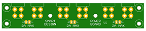
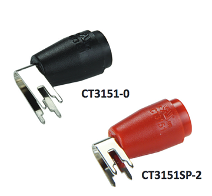
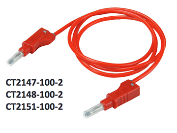

# Dev Board Holder

What is it?

Development board holders were conceived out of a necessity to handle  
multiple embedded development projects while keeping things organized  
and neat.  This is the latest version that has been streamlined to require  
as little fabrication time as possible.  It is made to be robust and look nice while being inexpensive and practical.  

_Installing standoffs does not require any tapping.  You can either thread them in or use a hand press to push them into place - its quick, clean and easy.  Key point here is to use a very specific diameter drill_

CAD is supplied in CREO 2 (aka ProEngineer) format, but if you like to create  
similar layouts in other formats let me know, I can help.  

Also note that some of the boards you will find placed on these holders are  
custom and you can just ignore them unless you feel like it would be good  
for you to have one, in which case I can add Eagle files to this repo.  

Note that there are two varieties of holders for now:  one for Arduino Mega 2560 (which is our board of choice for various fixtures and tests) and a raspberry pi holder.  

On the Arduino version, the solderless panel is mounted close to the board and on the RPi its mounted so that main block of the solderless board is centered on RPi's 40 pin header.  This is done in such a way because on Arduino board you want to make sure all wires can reach from PCB to the solderless board.  On the RPi, you want to use an adapter with ribbon cable which makes aligning center solderless block to 40 pin header the ideal choice.

The hookup board with 6 connectors that can be seen on the Mega holder is a utility board for hooking up the holder to a DC power supply.

We have a 3 channel Keithley on our workbench so it helps to keep track on where different channels go.  Also, you need a safety banana plug cable.  I like the ones from CalTest

Cheers.

Here is what you need to make one:

1.  12 in X 6 in X 1/2 inch thick Acrylic block (McMaster 4615T55 $13.41, you can also go with 1/4 which is 
    half the price but dont look as nice.)  
2.  **2.3 mm diameter drill (Need this exact diameter, smaller or larger wont work)**
3.  M2.5x.45 10mm Hex Standoff (DigiKey 732-10397-ND) (Make sure its M2.5x.45 thread, a different thred wont work.)
4.  Either
    * Hand Press to press fit standoffs into the holes. (Standoffs can be pressed into 2.3 mm holes  
    directly which saves lots of time.)
    * Power Drill with 5mm socket to thread standoff in. (If you do not have a press, you can just thread the standoffs 
    in without tapping - it takes more time and you might strip threads if you rush it.)
5.  M2.5x.45 X 5 MM Pan Head Phillips (McMaster 92005A061)
6.  M2.5x.45 X 16 MM Long Flat Head (McMaster 92010A024)
7.  Solderless breadboard (DigiKey BKGS-590-ND)
8.  Solderless breadboard Strip (BKGS-090-ND, I use 3 but its up to you.)

Here is how to make it:

1. Print out a 1:1 drawing of the layout you setup in CAD (This is my RaspberryPi holder.  
Think carefully where you place stuff and where connectors, sim cards and sd cards end up.)
2. Get the clear block and send and polish the edges (DO NOT REMOVE BLUE FILM, this will  
make the holder look extra nice)
3. Clean the block while keeping the blue film on.
4. Cutout the silhouette of the layout and spray it with backing adhesive.
5. Mount print out on the block.
6. Use drill press to drill all the marked holes.
7. Once the holes are drilled, you can peal the blue film off the top side
8. Press fit or thread the stand offs (if threading in, make sure you dont  
strip the treads...)
9. Peal bottom blue film off
9. Attach feet (I buy nice clear self adhesive feet on Amazon for a few bucks.)
10. Clean off any polishing compound or dust.
11. Attach solderless board and strips. (Again, make sure not to strip the treads.)